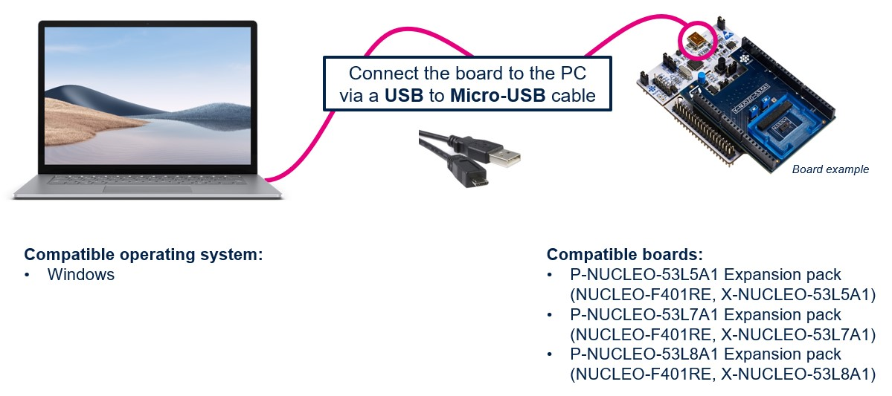

# sEMG Hand Prosthesis Model Deployment

This tutorial demonstrates how to deploy a trained Random Forest model for sEMG-based hand gesture recognition on an STM32H7S3L8 board.

<details open><summary><a href="#1"><b>1. Before You Start</b></a></summary><a id="1"></a>

<ul><details open><summary><a href="#1-1">1.1 Hardware Setup</a></summary><a id="1-1"></a>

The sEMG hand prosthesis system requires the following hardware setup:

**Core Components:**
- [NUCLEO-H7S3L8](https://www.st.com/en/evaluation-tools/nucleo-h7s3l8.html) development board
- Custom EMG acquisition board with ADS1299 (4-channel, 24-bit ADC)
- LIS3DH accelerometer module (I2C interface)
- 6x hobby servos (MG90S or similar)
- 7.4V LiPo battery (2S, 2000mAh minimum)

**Connections:**
- EMG Board → SPI1 (PA4-7)
- Accelerometer → I2C1 (PB8-9)
- Servos → TIM1 PWM channels (PE9, PE11, PE13, PE14, PA8, PA9)
- Debug → USART3 (115200 baud)

</details></ul>

<ul><details open><summary><a href="#1-2">1.2 Software Requirements</a></summary><a id="1-2"></a>

Required software tools:

1. **STM32CubeIDE** (v1.17.0 or later)
   - Download from [ST website](https://www.st.com/en/development-tools/stm32cubeide.html)
   - Install with default settings

2. **STM32Cube.AI** (v10.0.0 or later)
   - For Random Forest to C code conversion
   - Available via [STM32 Developer Cloud](https://stedgeai-dc.st.com/home) or local installation

3. **Python Environment** (3.8+)
   - scikit-learn for model training
   - numpy, scipy for signal processing
   - pyserial for device communication

4. **Terminal Software**
   - Tera Term, PuTTY, or similar
   - For debugging and monitoring

</details></ul>

<ul><details open><summary><a href="#1-3">1.3 System Specifications</a></summary><a id="1-3"></a>

- **MCU**: STM32H7S3L8 (Cortex-M7, 280 MHz)
- **Memory**: 64KB SRAM, 512KB Flash
- **Real-time OS**: FreeRTOS
- **Latency**: <100ms end-to-end
- **Sample Rate**: 1 kHz EMG acquisition
- **Classification**: Random Forest (3-29 classes)

</details></ul>
</details>

<details open><summary><a href="#2"><b>2. Configure the YAML File</b></a></summary><a id="2"></a>

Configure the deployment using either `deployment_config.yaml` or update `user_config.yaml`:

<ul><details open><summary><a href="#2-1">2.1 Model Configuration</a></summary><a id="2-1"></a>

```yaml
general:
  model_path: ../pretrained_models/rf_3class_model.h5
  # or use your trained model: ./saved_models/best_model.h5

operation_mode: deployment
```

The model file should be either:
- A trained Random Forest model (`.pkl` or `.h5`)
- A pre-trained model from the model zoo

</details></ul>

<ul><details open><summary><a href="#2-2">2.2 Dataset Configuration</a></summary><a id="2-2"></a>

```yaml
dataset:
  class_names: [open_hand, closed_fist, peace_sign]
  # For full TSL: [A, B, C, D, E, F, G, H, I, J, K, L, M, N, O, P, Q, R, S, T, U, V, W, X, Y, Z, Space, Delete, Enter]
  
preprocessing:
  sampling_rate: 1000
  window_size: 256
  overlap: 0.5
  features:
    - rms
    - mav
    - var
    - zc
    - ssc
    - wl
    - mean_freq
    - median_freq
    - band_power
```

</details></ul>

<ul><details open><summary><a href="#2-3">2.3 Deployment Parameters</a></summary><a id="2-3"></a>

```yaml
tools:
  stedgeai:
    version: 10.0.0
    optimization: balanced  # Options: balanced, time, ram
    on_cloud: True
    path_to_stedgeai: C:/STM32Cube/X-CUBE-AI/Utilities/windows/stedgeai.exe
  path_to_cubeIDE: C:/ST/STM32CubeIDE_1.17.0/STM32CubeIDE/stm32cubeide.exe

deployment:
  c_project_path: ../src/
  IDE: STM32CubeIDE
  verbosity: 1
  hardware_setup:
    serie: STM32H7
    board: NUCLEO-H7S3L8
    
  # EMG-specific settings
  emg_config:
    channels: 4
    gain: 24
    reference: external
    
  servo_config:
    pwm_frequency: 50  # Hz
    min_pulse: 1000    # microseconds
    max_pulse: 2000    # microseconds
```

</details></ul>

<ul><details open><summary><a href="#2-4">2.4 Memory Optimization</a></summary><a id="2-4"></a>

```yaml
optimization:
  quantization:
    enabled: true
    type: int8  # 8-bit quantization
    
  model_compression:
    max_trees: 15
    max_depth: 6
    pruning_threshold: 0.01
    
  memory_allocation:
    rf_model_flash: 32768  # 32KB max
    rf_runtime_ram: 12288  # 12KB max
```

</details></ul>
</details>

<details open><summary><a href="#3"><b>3. Deploy Model on STM32 Board</b></a></summary><a id="3"></a>

<ul><details open><summary><a href="#3-1">3.1 Hardware Connection</a></summary><a id="3-1"></a>

1. **Connect EMG Acquisition Board**
   - SPI1: MOSI(PA7), MISO(PA6), SCK(PA5), CS(PA4)
   - DRDY interrupt: PB0
   - Power: 3.3V and GND

2. **Connect Accelerometer**
   - I2C1: SDA(PB9), SCL(PB8)
   - INT1: PC0 (optional)
   - Power: 3.3V and GND

3. **Connect Servos**
   - Servo 1-4: PE9, PE11, PE13, PE14
   - Servo 5-6: PA8, PA9
   - Power: 5V from external supply
   - Common ground with MCU

4. **Connect USB**
   - Use USB cable to connect NUCLEO board to PC
   - This provides power and debug interface



</details></ul>

<ul><details open><summary><a href="#3-2">3.2 Build and Flash</a></summary><a id="3-2"></a>

Deploy the model by running:

```bash
# Using user_config.yaml
python stm32ai_main.py

# Or using specific deployment config
python stm32ai_main.py --config-path ./src/config_file_examples/ --config-name deployment_config.yaml
```

This will:
1. Convert Random Forest model to optimized C code
2. Generate model header files
3. Build the firmware project
4. Flash the binary to the STM32 board

Expected output:
```
[INFO] Loading Random Forest model...
[INFO] Converting to C code (15 trees, 6 max depth)...
[INFO] Model size: Flash: 28.5KB, RAM: 10.2KB
[INFO] Building firmware...
[INFO] Flashing to NUCLEO-H7S3L8...
[INFO] Deployment successful!
```

</details></ul>
</details>

<details open><summary><a href="#4"><b>4. Test the Deployed System</b></a></summary><a id="4"></a>

<ul><details open><summary><a href="#4-1">4.1 Serial Terminal Interface</a></summary><a id="4-1"></a>

1. **Connect via Serial Terminal**
   - Port: Auto-detected STLink VCP
   - Baudrate: 115200
   - Data bits: 8, Stop bits: 1, Parity: None

2. **Available Commands**
   ```
   SYS:INFO?      - System information
   EMG:START      - Start EMG acquisition
   EMG:STOP       - Stop EMG acquisition
   EMG:CAL        - Calibrate EMG channels
   ML:STATS?      - Get classification statistics
   SERVO:TEST <n> - Test servo n (0-5)
   DEBUG:ON/OFF   - Enable/disable debug output
   ```

3. **Example Session**
   ```
   > SYS:INFO?
   === System Information ===
   Firmware: sEMG Prosthesis v1.0.0
   Model: Random Forest (3 classes)
   Memory: RF Model 28.5KB Flash, 10.2KB RAM
   Status: Ready
   
   > EMG:START
   EMG acquisition started.
   
   > DEBUG:ON
   Debug output enabled.
   [EMG] Ch1: 0.023mV, Ch2: 0.019mV, Ch3: 0.031mV, Ch4: 0.027mV
   [ML] Gesture: open_hand (92% confidence)
   [Servo] Moving to gesture position...
   ```

</details></ul>

<ul><details open><summary><a href="#4-2">4.2 Real-time Monitoring</a></summary><a id="4-2"></a>

**Python Monitoring Script**

```python
# monitor_system.py
import serial
import matplotlib.pyplot as plt
import numpy as np

# Connect to device
ser = serial.Serial('COM3', 115200)

# Start data streaming
ser.write(b'EMG:START\r\n')
ser.write(b'DEBUG:ON\r\n')

# Real-time plotting
plt.ion()
fig, (ax1, ax2) = plt.subplots(2, 1)

while True:
    line = ser.readline().decode()
    if '[EMG]' in line:
        # Parse and plot EMG data
        # ...
    elif '[ML]' in line:
        # Display gesture recognition
        # ...
```

</details></ul>

<ul><details open><summary><a href="#4-3">4.3 Performance Validation</a></summary><a id="4-3"></a>

**Key Metrics to Verify:**

1. **Latency Measurement**
   - Target: <100ms from EMG to servo movement
   - Measure using oscilloscope or timing logs

2. **Classification Accuracy**
   - Test with multiple users
   - Verify all trained gestures
   - Check confidence levels

3. **Power Consumption**
   - Measure current draw
   - Verify battery life >4 hours

4. **Reliability Tests**
   - Long-duration operation
   - EMI/noise immunity
   - Temperature stability

</details></ul>
</details>

<details open><summary><a href="#5"><b>5. Troubleshooting</b></a></summary><a id="5"></a>

**Common Issues:**

1. **"Model too large for Flash"**
   - Reduce number of trees or max depth
   - Enable more aggressive quantization
   - Use feature selection to reduce inputs

2. **"EMG signal noisy/unstable"**
   - Check electrode placement and skin prep
   - Verify grounding and shielding
   - Ensure proper power supply filtering

3. **"Servo jitter or incorrect movement"**
   - Verify PWM frequency (50 Hz)
   - Check servo power supply
   - Calibrate pulse width ranges

4. **"Classification accuracy low"**
   - Retrain with more diverse data
   - Check feature extraction pipeline
   - Verify preprocessing parameters match training

5. **"System crashes or hangs"**
   - Check stack sizes in FreeRTOS
   - Monitor heap usage
   - Verify interrupt priorities

**Debug Mode:**

Enable verbose debugging:
```yaml
deployment:
  debug:
    enable_profiling: true
    log_level: verbose
    uart_trace: true
```

This provides detailed timing and memory usage information during runtime.

</details>

<details open><summary><a href="#6"><b>6. Advanced Features</b></a></summary><a id="6"></a>

**Future Enhancements:**

1. **Wireless Connectivity**
   - Add ESP32 for WiFi/Bluetooth
   - Remote monitoring and control
   - OTA firmware updates

2. **Adaptive Learning**
   - Online model updates
   - User-specific calibration
   - Gesture customization

3. **Extended Gestures**
   - Scale to 29 TSL letters
   - Sequential gesture recognition
   - Context-aware predictions

4. **Safety Features**
   - Force feedback sensors
   - Emergency stop mechanism
   - Battery management system

</details>
